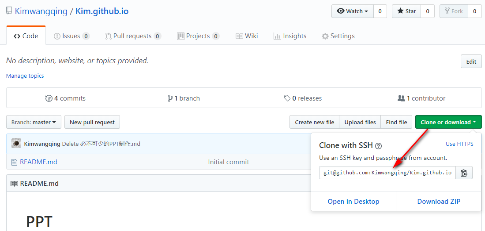

# 如何使用 Git 搭建个人博客
## Git 的使用
### Git 的准备工作
1. 下载安装 Git.

2. 进入 <https://github.com/> 注册账号。

3. 登录 Github 账户。

### 远程仓库存 Git 的配置
1. 新建一个仓库（远程库 Repository，之后远程库的名字就是 origin，这是 Git 默认的叫法，也可以改成别的，但是 origin 这个名字一看就知道是远程库。
**仓库命名格式：“你的名字.github.io”。**

2. 配置 SSH Key：

 a. 获取 SSH Key 有两种方式：
 
 * 在本地仓库所在的文件目录右键 --> Git GUI Here --> Help --> Show SSH Key；
 * 在 C:\Users 里找到 id_rsa.pub 文件，里面既是 SSH Key。
	
 b. 配置 SSH Key：Settings --> SSH and GPG keys。
    
3. 用户配置：
   Git是分布式版本控制系统，所以需要填写用户名和邮箱作为一个标识，使用 Bash 命令完成。如下图所示：      

   
   如果想查看用户和邮箱，使用 Bash 命令完成。如下图所示：   

    
** 以上 1、2 步骤无先后顺序。**

### 创建一个本地仓库：

找一个目录作为本地的仓库，比如我要对 D:\myBlog\Kim.github.io 里的项目进行管理，那么就在 Kim.github.io 下初始化仓库。

初始化仓库有两种方式：

* 通过 Git 的图形化界面来创建；
  在 Kim.github.io 的目录下右键选择 Git GUI Here –> 选择 Create New Repository。      
* 通过 Bash 命令完成。如下图所示：    

      
 ** 创建本地仓库后，本地目录里多了一个 .git 文件，有时是隐藏状态。**

### 本地操作
#### 概念理解

```mermaid
graph LR
D1((工作区))-->D2((暂存区))
D2((暂存区))-->D3((本地仓库))
```

* 工作区：是编辑器所处的那个文件，在这个指的就是 Kim.github.io 这个文件夹。
* 本地仓：是 .git 文件。

文档写完之后就是往工作区增添了一个文件，然后使用 'git status' 查看状态，'git status' 是查看工作区和暂存区有没有未被提交到本地仓库的文件：
* 工作区有未向暂存区保存的文件显示红色，使用 'git add ./文件名' 保存；
* 暂存区有未向本地仓库提交的文件显示绿色，使用 'git commit -m "描述"/-a' 提交。

提交的时候一般常用两种方式：
* 'git commit -a'
  这种方式提交时，不需要执行 'git add' 操作，自动就把所有修改的文件提交了。
* 'git commit -m "描述"'
  这种方式只会提交之前保存的文件，所以想提交那些文件，先执行保存，之后，再 'git commit -m "描述"'。
**第二种方式，提交前可以做修改，切记不要直接运行 'git commit -a'，它会忽视之前做的修改而把所有东西都提交到仓库中去。**
**描述意思添加一个备注，可以随意写，也可以理解为改动记录，必须要有，不然会报错。**

#### 具体操作 
1. 先将写好的文档保至本地仓库： 
 
 a. 查看文档状态，使用 'git status' 命令完成。如下图所示  

文件是红色，这是说明我们这个文件已经做了修改，但是还未保存到暂存区。

 b. 执行保存，使用 'git add ./文件名' 命令完成：
 
  * 保存所有文件，使用 'git add .' 命令。如下图所示:     

 **add 与点符之间有一个空格。** 

 * 保存单个文件，使用 'git add 文件名' 命令。如下图所示：

 *之后，可以再次使用 'git status' 查看状态：* 
 
 此时，之前红色的文件都变成绿色。
 
 c. 执行提交，使用 'git commit -m "描述"/-a' 命令。如下图所示：

此为提交单个文件示例。
 * 使用 'git commit -m "描述"' 对应保存步骤，可以提交所有文件或单个文件，如果上一步使用 'git add .'，
执行提交后，即可提交所有文件；
 * 使用 'git commit -m "描述"' 对应保存步骤，可以提交所有文件或单个文件，如果上一步使用 'git add 文件名'，执行提交后，即可提交单个文件；
 * 使用 'git commit -a'，这种方式提交的时，不需要执行 'git add' 操作，自动就把所有修改的文件提交了。

2. 本地仓库与远程仓库关联：
在本地仓库下运行命令：
执行 '$ git remote add origin gitSSH地址' 命令：
 a. 获取 SSH 地址，如下图所示：
 
 
 b. 执行以上命令，如下图所示：
 

3. 推送